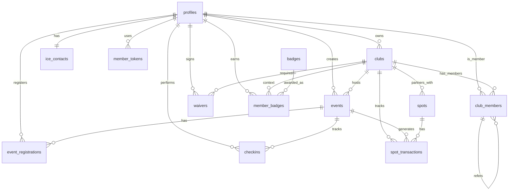

# CAPTEN Database Schema Specification

This document specifies the complete Supabase (PostgreSQL) database schema for CAPTEN, covering all required tables, relationships, indexes, RLS policies, functions, triggers, and views.

## 1. Entity-Relationship Diagram (ERD)



## 2. Custom Types (Enums)

```sql
CREATE TYPE profile_role AS ENUM ('organizer', 'member');
CREATE TYPE sport_type AS ENUM ('run', 'walk', 'trail', 'rando', 'mixed');
CREATE TYPE club_role AS ENUM ('member', 'co_organizer', 'admin');
CREATE TYPE event_status AS ENUM ('draft', 'published', 'cancelled', 'completed');
CREATE TYPE registration_status AS ENUM ('registered', 'cancelled', 'waitlisted');
CREATE TYPE checkin_method AS ENUM ('gps', 'qr_code', 'manual');
CREATE TYPE spot_tx_status AS ENUM ('pending', 'confirmed', 'paid_out');
CREATE TYPE badge_category AS ENUM ('participation', 'discovery', 'community', 'loyalty');
```

## 3. Tables Definition

### 3.1 `profiles`
Extends Supabase `auth.users` to store application-specific user data.

```sql
CREATE TABLE profiles (
    id UUID PRIMARY KEY REFERENCES auth.users(id) ON DELETE CASCADE,
    email TEXT NOT NULL,
    full_name TEXT,
    phone TEXT UNIQUE,
    avatar_url TEXT,
    role profile_role NOT NULL DEFAULT 'member',
    created_at TIMESTAMPTZ NOT NULL DEFAULT NOW(),
    updated_at TIMESTAMPTZ NOT NULL DEFAULT NOW()
);

-- Indexes
CREATE INDEX idx_profiles_email ON profiles(email);
CREATE INDEX idx_profiles_role ON profiles(role);

-- RLS
ALTER TABLE profiles ENABLE ROW LEVEL SECURITY;
CREATE POLICY "Public profiles are viewable by everyone" ON profiles FOR SELECT USING (true);
CREATE POLICY "Users can insert their own profile" ON profiles FOR INSERT WITH CHECK (auth.uid() = id);
CREATE POLICY "Users can update own profile" ON profiles FOR UPDATE USING (auth.uid() = id);
```

### 3.2 `clubs`
Run clubs, Walk Socials, etc. created by organizers.

```sql
CREATE TABLE clubs (
    id UUID PRIMARY KEY DEFAULT gen_random_uuid(),
    owner_id UUID NOT NULL REFERENCES profiles(id) ON DELETE RESTRICT,
    name TEXT NOT NULL,
    slug TEXT UNIQUE NOT NULL,
    description TEXT,
    logo_url TEXT,
    instagram_url TEXT,
    whatsapp_link TEXT,
    city TEXT,
    sport_type sport_type NOT NULL DEFAULT 'run',
    is_active BOOLEAN NOT NULL DEFAULT true,
    max_members INTEGER,
    created_at TIMESTAMPTZ NOT NULL DEFAULT NOW(),
    updated_at TIMESTAMPTZ NOT NULL DEFAULT NOW()
);

-- Indexes
CREATE INDEX idx_clubs_owner ON clubs(owner_id);
CREATE INDEX idx_clubs_slug ON clubs(slug);
CREATE INDEX idx_clubs_city ON clubs(city);

-- RLS
ALTER TABLE clubs ENABLE ROW LEVEL SECURITY;
CREATE POLICY "Clubs are viewable by everyone" ON clubs FOR SELECT USING (true);
CREATE POLICY "Organizers can create clubs" ON clubs FOR INSERT WITH CHECK (
    EXISTS (SELECT 1 FROM profiles WHERE id = auth.uid() AND role = 'organizer')
);
CREATE POLICY "Owners can update their clubs" ON clubs FOR UPDATE USING (auth.uid() = owner_id);
```

### 3.3 `club_members`
Links profiles to clubs with specific roles.

```sql
CREATE TABLE club_members (
    id UUID PRIMARY KEY DEFAULT gen_random_uuid(),
    club_id UUID NOT NULL REFERENCES clubs(id) ON DELETE CASCADE,
    member_id UUID NOT NULL REFERENCES profiles(id) ON DELETE CASCADE,
    role club_role NOT NULL DEFAULT 'member',
    joined_at TIMESTAMPTZ NOT NULL DEFAULT NOW(),
    is_active BOOLEAN NOT NULL DEFAULT true,
    referral_code TEXT UNIQUE DEFAULT encode(gen_random_bytes(4), 'hex'),
    referred_by UUID REFERENCES club_members(id) ON DELETE SET NULL,
    UNIQUE(club_id, member_id)
);

-- Indexes
CREATE INDEX idx_club_members_club_id ON club_members(club_id);
CREATE INDEX idx_club_members_member_id ON club_members(member_id);
CREATE INDEX idx_club_members_referral ON club_members(referral_code);

-- RLS
ALTER TABLE club_members ENABLE ROW LEVEL SECURITY;
CREATE POLICY "Members viewable by club members and public" ON club_members FOR SELECT USING (true);
CREATE POLICY "Users can join clubs" ON club_members FOR INSERT WITH CHECK (auth.uid() = member_id);
CREATE POLICY "Club admins can update members" ON club_members FOR UPDATE USING (
    EXISTS (SELECT 1 FROM club_members cm WHERE cm.club_id = club_members.club_id AND cm.member_id = auth.uid() AND cm.role IN ('admin', 'co_organizer'))
);
```

### 3.4 `events`
Sorties and gatherings organized by a club.

```sql
CREATE TABLE events (
    id UUID PRIMARY KEY DEFAULT gen_random_uuid(),
    club_id UUID NOT NULL REFERENCES clubs(id) ON DELETE CASCADE,
    created_by UUID NOT NULL REFERENCES profiles(id) ON DELETE RESTRICT,
    title TEXT NOT NULL,
    description TEXT,
    event_date TIMESTAMPTZ NOT NULL,
    meeting_point_lat DOUBLE PRECISION,
    meeting_point_lng DOUBLE PRECISION,
    meeting_point_address TEXT,
    max_participants INTEGER,
    is_recurring BOOLEAN NOT NULL DEFAULT false,
    recurrence_rule TEXT,
    status event_status NOT NULL DEFAULT 'draft',
    checkin_radius_meters INTEGER NOT NULL DEFAULT 200,
    photos_url TEXT,
    created_at TIMESTAMPTZ NOT NULL DEFAULT NOW(),
    updated_at TIMESTAMPTZ NOT NULL DEFAULT NOW()
);

-- Indexes
CREATE INDEX idx_events_club_id ON events(club_id);
CREATE INDEX idx_events_date ON events(event_date);
CREATE INDEX idx_events_status ON events(status);

-- RLS
ALTER TABLE events ENABLE ROW LEVEL SECURITY;
CREATE POLICY "Published events are public" ON events FOR SELECT USING (status = 'published' OR status = 'completed');
CREATE POLICY "Club admins can manage events" ON events FOR ALL USING (
    EXISTS (SELECT 1 FROM club_members cm WHERE cm.club_id = events.club_id AND cm.member_id = auth.uid() AND cm.role IN ('admin', 'co_organizer'))
);
```

### 3.5 `event_registrations`
Tracks members registering for events.

```sql
CREATE TABLE event_registrations (
    id UUID PRIMARY KEY DEFAULT gen_random_uuid(),
    event_id UUID NOT NULL REFERENCES events(id) ON DELETE CASCADE,
    member_id UUID NOT NULL REFERENCES profiles(id) ON DELETE CASCADE,
    registered_at TIMESTAMPTZ NOT NULL DEFAULT NOW(),
    status registration_status NOT NULL DEFAULT 'registered',
    UNIQUE(event_id, member_id)
);

-- Indexes
CREATE INDEX idx_event_reg_event ON event_registrations(event_id);
CREATE INDEX idx_event_reg_member ON event_registrations(member_id);

-- RLS
ALTER TABLE event_registrations ENABLE ROW LEVEL SECURITY;
CREATE POLICY "Registrations viewable by club admins and self" ON event_registrations FOR SELECT USING (
    auth.uid() = member_id OR 
    EXISTS (SELECT 1 FROM events e JOIN club_members cm ON e.club_id = cm.club_id WHERE e.id = event_registrations.event_id AND cm.member_id = auth.uid() AND cm.role IN ('admin', 'co_organizer'))
);
CREATE POLICY "Users can register themselves" ON event_registrations FOR INSERT WITH CHECK (auth.uid() = member_id);
CREATE POLICY "Users can update own registration" ON event_registrations FOR UPDATE USING (auth.uid() = member_id);
```

### 3.6 `checkins`
Tracks physical presence at events via GPS or QR.

```sql
CREATE TABLE checkins (
    id UUID PRIMARY KEY DEFAULT gen_random_uuid(),
    event_id UUID NOT NULL REFERENCES events(id) ON DELETE CASCADE,
    member_id UUID NOT NULL REFERENCES profiles(id) ON DELETE CASCADE,
    checkin_at TIMESTAMPTZ NOT NULL DEFAULT NOW(),
    latitude DOUBLE PRECISION,
    longitude DOUBLE PRECISION,
    distance_from_meeting_point DOUBLE PRECISION,
    method checkin_method NOT NULL,
    is_valid BOOLEAN NOT NULL DEFAULT false,
    UNIQUE(event_id, member_id)
);

-- Indexes
CREATE INDEX idx_checkins_event ON checkins(event_id);
CREATE INDEX idx_checkins_member ON checkins(member_id);

-- RLS
ALTER TABLE checkins ENABLE ROW LEVEL SECURITY;
CREATE POLICY "Checkins viewable by self and admins" ON checkins FOR SELECT USING (
    auth.uid() = member_id OR 
    EXISTS (SELECT 1 FROM events e JOIN club_members cm ON e.club_id = cm.club_id WHERE e.id = checkins.event_id AND cm.member_id = auth.uid() AND cm.role IN ('admin', 'co_organizer'))
);
CREATE POLICY "Users can check themselves in" ON checkins FOR INSERT WITH CHECK (auth.uid() = member_id);
```

### 3.7 `ice_contacts`
In Case of Emergency contacts.

```sql
CREATE TABLE ice_contacts (
    id UUID PRIMARY KEY DEFAULT gen_random_uuid(),
    member_id UUID NOT NULL UNIQUE REFERENCES profiles(id) ON DELETE CASCADE,
    emergency_contact_name TEXT,
    emergency_contact_phone TEXT,
    emergency_contact_relation TEXT,
    blood_type TEXT,
    allergies TEXT,
    medical_conditions TEXT,
    medications TEXT,
    is_complete BOOLEAN GENERATED ALWAYS AS (
        emergency_contact_name IS NOT NULL AND 
        emergency_contact_phone IS NOT NULL AND 
        emergency_contact_relation IS NOT NULL
    ) STORED,
    updated_at TIMESTAMPTZ NOT NULL DEFAULT NOW()
);

-- Indexes
CREATE INDEX idx_ice_member ON ice_contacts(member_id);

-- RLS
ALTER TABLE ice_contacts ENABLE ROW LEVEL SECURITY;
CREATE POLICY "Users manage own ICE info" ON ice_contacts FOR ALL USING (auth.uid() = member_id);
CREATE POLICY "Admins can view ICE info of registered members for upcoming events" ON ice_contacts FOR SELECT USING (
    EXISTS (
        SELECT 1 FROM event_registrations er
        JOIN events e ON er.event_id = e.id
        JOIN club_members cm ON e.club_id = cm.club_id
        WHERE er.member_id = ice_contacts.member_id
        AND cm.member_id = auth.uid() 
        AND cm.role IN ('admin', 'co_organizer')
        AND e.event_date >= NOW() - INTERVAL '1 day'
        AND e.event_date <= NOW() + INTERVAL '1 day'
    )
);
```

### 3.8 `waivers`
Legal consent tracking.

```sql
CREATE TABLE waivers (
    id UUID PRIMARY KEY DEFAULT gen_random_uuid(),
    club_id UUID NOT NULL REFERENCES clubs(id) ON DELETE CASCADE,
    member_id UUID NOT NULL REFERENCES profiles(id) ON DELETE CASCADE,
    signed_at TIMESTAMPTZ NOT NULL DEFAULT NOW(),
    ip_address TEXT,
    user_agent TEXT,
    waiver_version TEXT NOT NULL DEFAULT '1.0',
    signature_hash TEXT NOT NULL,
    is_valid BOOLEAN NOT NULL DEFAULT true,
    UNIQUE(club_id, member_id, waiver_version)
);

-- Indexes
CREATE INDEX idx_waivers_member_club ON waivers(member_id, club_id);

-- RLS
ALTER TABLE waivers ENABLE ROW LEVEL SECURITY;
CREATE POLICY "View own waivers" ON waivers FOR SELECT USING (auth.uid() = member_id);
CREATE POLICY "Insert own waivers" ON waivers FOR INSERT WITH CHECK (auth.uid() = member_id);
```

### 3.9 `spots`
CAPTEN Spots (partners).

```sql
CREATE TABLE spots (
    id UUID PRIMARY KEY DEFAULT gen_random_uuid(),
    club_id UUID NOT NULL REFERENCES clubs(id) ON DELETE CASCADE,
    name TEXT NOT NULL,
    address TEXT,
    latitude DOUBLE PRECISION,
    longitude DOUBLE PRECISION,
    contact_name TEXT,
    contact_phone TEXT,
    contact_email TEXT,
    commission_rate DECIMAL(4,3) NOT NULL DEFAULT 0.10,
    is_active BOOLEAN NOT NULL DEFAULT true,
    created_at TIMESTAMPTZ NOT NULL DEFAULT NOW(),
    updated_at TIMESTAMPTZ NOT NULL DEFAULT NOW()
);

-- RLS
ALTER TABLE spots ENABLE ROW LEVEL SECURITY;
CREATE POLICY "Spots viewable by public" ON spots FOR SELECT USING (is_active = true);
CREATE POLICY "Club admins manage spots" ON spots FOR ALL USING (
    EXISTS (SELECT 1 FROM club_members cm WHERE cm.club_id = spots.club_id AND cm.member_id = auth.uid() AND cm.role IN ('admin', 'co_organizer'))
);
```

### 3.10 `spot_transactions`
Cashback/commission tracking for spots.

```sql
CREATE TABLE spot_transactions (
    id UUID PRIMARY KEY DEFAULT gen_random_uuid(),
    spot_id UUID NOT NULL REFERENCES spots(id) ON DELETE CASCADE,
    club_id UUID NOT NULL REFERENCES clubs(id) ON DELETE CASCADE,
    event_id UUID REFERENCES events(id) ON DELETE SET NULL,
    amount DECIMAL(10,2) NOT NULL,
    commission_amount DECIMAL(10,2) NOT NULL,
    transaction_date TIMESTAMPTZ NOT NULL DEFAULT NOW(),
    status spot_tx_status NOT NULL DEFAULT 'pending',
    created_at TIMESTAMPTZ NOT NULL DEFAULT NOW()
);

-- Indexes
CREATE INDEX idx_spot_tx_spot ON spot_transactions(spot_id);
CREATE INDEX idx_spot_tx_club ON spot_transactions(club_id);

-- RLS
ALTER TABLE spot_transactions ENABLE ROW LEVEL SECURITY;
CREATE POLICY "Club admins view transactions" ON spot_transactions FOR SELECT USING (
    EXISTS (SELECT 1 FROM club_members cm WHERE cm.club_id = spot_transactions.club_id AND cm.member_id = auth.uid() AND cm.role IN ('admin', 'co_organizer'))
);
```

### 3.11 `badges`
System-wide gamification badges.

```sql
CREATE TABLE badges (
    id UUID PRIMARY KEY DEFAULT gen_random_uuid(),
    slug TEXT UNIQUE NOT NULL,
    name TEXT NOT NULL,
    description TEXT,
    emoji TEXT,
    category badge_category NOT NULL,
    threshold INTEGER NOT NULL DEFAULT 1,
    is_active BOOLEAN NOT NULL DEFAULT true
);

-- RLS
ALTER TABLE badges ENABLE ROW LEVEL SECURITY;
CREATE POLICY "Badges are public" ON badges FOR SELECT USING (is_active = true);
```

### 3.12 `member_badges`
Awarded badges.

```sql
CREATE TABLE member_badges (
    id UUID PRIMARY KEY DEFAULT gen_random_uuid(),
    member_id UUID NOT NULL REFERENCES profiles(id) ON DELETE CASCADE,
    badge_id UUID NOT NULL REFERENCES badges(id) ON DELETE CASCADE,
    unlocked_at TIMESTAMPTZ NOT NULL DEFAULT NOW(),
    club_id UUID REFERENCES clubs(id) ON DELETE CASCADE,
    UNIQUE(member_id, badge_id, club_id)
);

-- Indexes
CREATE INDEX idx_mb_member ON member_badges(member_id);

-- RLS
ALTER TABLE member_badges ENABLE ROW LEVEL SECURITY;
CREATE POLICY "Member badges are public" ON member_badges FOR SELECT USING (true);
```

### 3.13 `member_tokens`
Passwordless micropage access.

```sql
CREATE TABLE member_tokens (
    id UUID PRIMARY KEY DEFAULT gen_random_uuid(),
    member_id UUID NOT NULL REFERENCES profiles(id) ON DELETE CASCADE,
    token TEXT UNIQUE NOT NULL DEFAULT encode(gen_random_bytes(16), 'hex'),
    created_at TIMESTAMPTZ NOT NULL DEFAULT NOW(),
    expires_at TIMESTAMPTZ,
    is_active BOOLEAN NOT NULL DEFAULT true
);

-- Indexes
CREATE INDEX idx_member_tokens_token ON member_tokens(token);

-- RLS
ALTER TABLE member_tokens ENABLE ROW LEVEL SECURITY;
CREATE POLICY "View own tokens" ON member_tokens FOR SELECT USING (auth.uid() = member_id);
```

## 4. Functions & Triggers

### `calculate_distance` (Haversine Formula)
Used to validate if a GPS check-in is within the `checkin_radius_meters`.

```sql
CREATE OR REPLACE FUNCTION calculate_distance(lat1 FLOAT, lon1 FLOAT, lat2 FLOAT, lon2 FLOAT)
RETURNS FLOAT AS $$
DECLARE
    x FLOAT = 69.1 * (lat2 - lat1);
    y FLOAT = 69.1 * (lon2 - lon1) * cos(lat1 / 57.3);
BEGIN
    -- Returns distance in meters (approx)
    RETURN sqrt(x * x + y * y) * 1609.344;
END;
$$ LANGUAGE plpgsql IMMUTABLE;
```

### `trg_validate_checkin`
Auto-validates check-ins upon insertion.

```sql
CREATE OR REPLACE FUNCTION validate_checkin()
RETURNS TRIGGER AS $$
DECLARE
    target_lat FLOAT;
    target_lng FLOAT;
    radius INT;
    dist FLOAT;
BEGIN
    IF NEW.method = 'gps' THEN
        SELECT meeting_point_lat, meeting_point_lng, checkin_radius_meters 
        INTO target_lat, target_lng, radius
        FROM events WHERE id = NEW.event_id;
        
        IF target_lat IS NOT NULL AND target_lng IS NOT NULL AND NEW.latitude IS NOT NULL AND NEW.longitude IS NOT NULL THEN
            dist := calculate_distance(target_lat, target_lng, NEW.latitude, NEW.longitude);
            NEW.distance_from_meeting_point := dist;
            NEW.is_valid := dist <= radius;
        ELSE
            NEW.is_valid := false;
        END IF;
    ELSIF NEW.method = 'qr_code' THEN
        NEW.is_valid := true;
    END IF;
    RETURN NEW;
END;
$$ LANGUAGE plpgsql;

CREATE TRIGGER trg_validate_checkin
BEFORE INSERT ON checkins
FOR EACH ROW EXECUTE FUNCTION validate_checkin();
```

### `trg_award_first_run_badge`
Auto-awards the "Premier Run" badge upon first valid check-in.

```sql
CREATE OR REPLACE FUNCTION award_first_run_badge()
RETURNS TRIGGER AS $$
DECLARE
    badge_uuid UUID;
BEGIN
    IF NEW.is_valid = true THEN
        SELECT id INTO badge_uuid FROM badges WHERE slug = 'first_run' AND is_active = true;
        
        IF badge_uuid IS NOT NULL THEN
            INSERT INTO member_badges (member_id, badge_id)
            VALUES (NEW.member_id, badge_uuid)
            ON CONFLICT DO NOTHING;
        END IF;
    END IF;
    RETURN NEW;
END;
$$ LANGUAGE plpgsql;

CREATE TRIGGER trg_award_first_run
AFTER INSERT ON checkins
FOR EACH ROW EXECUTE FUNCTION award_first_run_badge();
```

## 5. Views

### `club_stats`
Aggregates key statistics for club organizers.

```sql
CREATE OR REPLACE VIEW club_stats AS
SELECT 
    c.id as club_id,
    c.name as club_name,
    COUNT(DISTINCT cm.member_id) as total_members,
    COUNT(DISTINCT e.id) as total_events,
    COUNT(DISTINCT ch.id) as total_checkins,
    COALESCE(SUM(st.commission_amount), 0) as total_spot_revenue
FROM clubs c
LEFT JOIN club_members cm ON c.id = cm.club_id AND cm.is_active = true
LEFT JOIN events e ON c.id = e.club_id
LEFT JOIN checkins ch ON e.id = ch.event_id AND ch.is_valid = true
LEFT JOIN spot_transactions st ON c.id = st.club_id AND st.status = 'paid_out'
GROUP BY c.id, c.name;
```

## 6. Seed Data (Badges)

```sql
INSERT INTO badges (slug, name, description, emoji, category, threshold) VALUES
('first_run', 'Premier Run', 'A participé à son premier événement avec succès.', '🥉', 'participation', 1),
('regular_runner', 'Régulier', 'A participé à 10 événements.', '🥈', 'loyalty', 10),
('legend', 'Légende', 'A participé à 50 événements.', '👑', 'loyalty', 50),
('explorer', 'Explorateur', 'A visité 3 CAPTEN Spots différents.', '🧭', 'discovery', 3),
('ambassador', 'Ambassadeur', 'A parrainé 5 nouveaux membres.', '🤝', 'community', 5);
```
