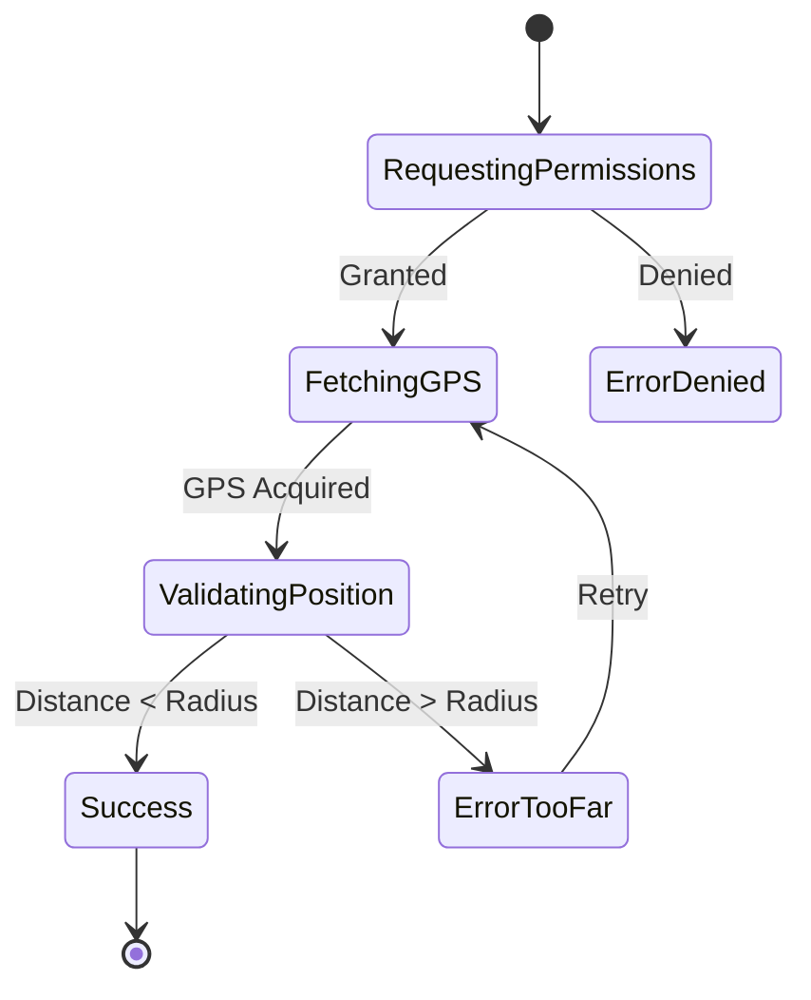

# CAPTEN UI/UX Specification

This document provides the comprehensive UI/UX and technical interface specification for the CAPTEN SaaS platform (B2B Dashboard and B2C Public Pages). It is intended to be used directly by AI coding agents and frontend engineers to build the application without ambiguity.

User-facing text and content are in **French**. Technical specifications, data models, and logic descriptions are in **English**.

---

## 1. Design System

The design system uses TailwindCSS for styling and Framer Motion for animations.

### 1.1 Design Tokens

#### Colors
Define these in `tailwind.config.ts` under `theme.extend.colors`:

| Token Name | Hex Value | Usage / Description |
| :--- | :--- | :--- |
| `capten-canvas` | `#F4F4EE` | App background, warm off-white. |
| `capten-primary` | `#FF5500` | Primary CTA buttons, active states, badges. |
| `capten-text-main` | `#1A1918` | Primary text (headings, body). |
| `capten-text-sec` | `#666562` | Secondary text (subtitles, descriptions, table headers). |
| `capten-text-muted` | `#999999` | Placeholders, disabled text. |
| `capten-white` | `#FFFFFF` | Standard card backgrounds, inputs. |
| `capten-dark` | `#1D1D1D` | Dark panels, sidebar background, dark cards. |
| `capten-beige` | `#EFEFE8` | FAQ cards, comparison table background, secondary cards. |
| `capten-success` | `#22C55E` | Check-in valid, ICE complete, success badges. |
| `capten-warning` | `#F59E0B` | Pending states, missing information. |
| `capten-error` | `#EF4444` | Invalid states, destructive actions, errors. |
| `capten-gold` | `#FFD700` | Premium badges, achievements. |

**Border Colors**:
- `border-light`: `rgba(0, 0, 0, 0.05)`
- `border-medium`: `rgba(0, 0, 0, 0.10)`

#### Typography
Load `Inter` (or `Plus Jakarta Sans`) via `next/font/google`.

| Element | Size | Weight | Line Height / Tracking |
| :--- | :--- | :--- | :--- |
| `H1` | 48-62px (md: 62px) | Extrabold (800) | Leading: 1.08, Tracking: tight |
| `H2` | 36-48px (md: 48px) | Extrabold (800) | Tracking: tight |
| `H3` | 24-28px | Bold (700) | Standard |
| `H4` | 18-20px | Bold (700) | Standard |
| `Body` | 14-16px | Medium (500) | Standard |
| `Small` | 12-13px | Medium (500) | Standard |
| `Caption` | 11px | Bold (700) | Uppercase, Tracking: widest |

#### Geometry & Spacing
- **Base Unit**: `4px` (`spacing` in Tailwind configuration).
- **Section Padding**: `80px` to `112px` vertical (`py-20` to `py-28`).
- **Card Padding**: `24px` to `32px` (`p-6` to `p-8`).
- **Component Gap**: `8px` to `16px` (`gap-2` to `gap-4`).
- **Container Max-Width**: `1200px` (`max-w-6xl`).

#### Border Radius
- `radius-button`: `999px` (`rounded-full`)
- `radius-card`: `24px` (`rounded-3xl` roughly, use custom class `rounded-[24px]`)
- `radius-input`: `12px` (`rounded-xl`)
- `radius-sm`: `8px` (`rounded-lg`)
- `radius-avatar`: `50%` (`rounded-full`)

#### Shadows
- `shadow-card`: `0 4px 24px rgba(0,0,0,0.06)`
- `shadow-elevated`: `0 12px 40px rgba(0,0,0,0.10)`
- `shadow-floating`: `0 25px 65px rgba(0,0,0,0.12)`
- `shadow-dark`: `0 30px 70px rgba(0,0,0,0.55)`

---

### 1.2 Component Library Specification

All components should be strictly typed using TypeScript and support Next.js 15 Server/Client component paradigms.

#### 1.2.1 Button Component
```tsx
interface ButtonProps extends React.ButtonHTMLAttributes<HTMLButtonElement> {
  variant?: 'primary' | 'secondary' | 'dark' | 'outline' | 'ghost';
  size?: 'sm' | 'md' | 'lg';
  isLoading?: boolean;
  leftIcon?: React.ReactNode;
  rightIcon?: React.ReactNode;
}
```
*   **Visuals**: Pill shape (`rounded-full`).
*   **Variants**:
    *   `primary`: `bg-[#FF5500] text-white hover:bg-[#E64D00]`
    *   `secondary`: `bg-white text-[#1A1918] border border-black/5`
    *   `dark`: `bg-[#1D1D1D] text-white`
    *   `outline`: `bg-transparent border-2 border-[#1A1918] text-[#1A1918]`
    *   `ghost`: `bg-transparent hover:bg-black/5 text-[#1A1918]`
*   **Sizes**: `sm` (h-8/32px, text-sm), `md` (h-10/40px, text-base), `lg` (h-12/48px, text-lg).
*   **States**:
    *   *Hover*: `hover:scale-[1.02]` (use framer-motion or tailwind `transform`), slight shadow increase.
    *   *Active*: `active:scale-[0.98]`.
    *   *Loading*: Show inline spinner icon, disable click, maintain width.
    *   *Disabled*: `opacity-50 cursor-not-allowed`.

#### 1.2.2 Card Component
```tsx
interface CardProps {
  children: React.ReactNode;
  variant?: 'white' | 'beige' | 'dark';
  isInteractive?: boolean; // If true, apply hover effects
  className?: string;
}
```
*   **Visuals**: `rounded-[24px] p-6` (24px padding). Border `1px solid rgba(0,0,0,0.05)`.
*   **Variants**: `white` (bg-white), `beige` (bg-[#EFEFE8]), `dark` (bg-[#1D1D1D] text-white).
*   **States**: If `isInteractive`, apply `hover:shadow-elevated transition-shadow duration-300`.

#### 1.2.3 Input Component
```tsx
interface InputProps extends React.InputHTMLAttributes<HTMLInputElement> {
  label: string;
  error?: string;
  helperText?: string;
}
```
*   **Visuals**: Height `44px`, `rounded-[12px]`, border `1px solid #E5E7EB`.
*   **Label**: Rendered above input. 12px, uppercase, bold (`text-[11px] font-bold uppercase tracking-widest text-[#666562]`).
*   **States**:
    *   *Focus*: `focus:border-[#FF5500] focus:ring-2 focus:ring-[#FF5500]/20 outline-none`.
    *   *Error*: Border turns `#EF4444`. Error message text below input in `text-[#EF4444] text-sm`.

#### 1.2.4 Badge Component
```tsx
interface BadgeProps {
  children: React.ReactNode;
  variant?: 'default' | 'success' | 'warning' | 'error' | 'gold';
}
```
*   **Visuals**: `px-3.5 py-1.5 rounded-full text-[11px] font-bold uppercase tracking-widest`.
*   **Variants**:
    *   `default`: `bg-[#E1E3D3] text-[#1A1918]`
    *   `success`: `bg-[#22C55E]/10 text-[#22C55E]`
    *   `warning`: `bg-[#F59E0B]/10 text-[#F59E0B]`
    *   `error`: `bg-[#EF4444]/10 text-[#EF4444]`
    *   `gold`: `bg-[#FFD700]/20 text-[#B8860B]`

#### 1.2.5 StatCard Component
```tsx
interface StatCardProps {
  label: string;
  value: string | number;
  trend?: { value: number; isPositive: boolean };
  statusColor?: 'green' | 'orange' | 'red';
}
```
*   **Visuals**: White card (`Card` base).
*   **Layout**: Top: Label (small caps). Middle: Huge value text (`text-4xl font-extrabold`). Bottom: Trend indicator (e.g., "↑ 12% vs mois dernier" in green).

#### 1.2.6 Avatar Component
```tsx
interface AvatarProps {
  src?: string;
  name: string; // Used for initials fallback
  size?: number; // Default 40
  isActive?: boolean; // Shows green dot
}
```
*   **Visuals**: Circle (`rounded-full`), overflow hidden. Image `object-cover`.
*   **Fallback**: If no `src`, show first two letters of `name` centered on a `#EFEFE8` background, text `#1A1918`.
*   **Status**: If `isActive`, absolutely position a `10px` green circle (`bg-[#22C55E] border-2 border-white`) at bottom-right.

#### 1.2.7 Modal Component
```tsx
interface ModalProps {
  isOpen: boolean;
  onClose: () => void;
  title: string;
  children: React.ReactNode;
}
```
*   **Visuals**: Backdrop `bg-black/40 backdrop-blur-sm`. Modal surface is a White Card with `rounded-[24px]`. Close button (`<X />` from lucide-react) top right.
*   **Animation (Framer Motion)**:
    *   Backdrop: `initial={{opacity: 0}} animate={{opacity: 1}} exit={{opacity: 0}}`
    *   Surface: `initial={{opacity: 0, y: 20}} animate={{opacity: 1, y: 0}} exit={{opacity: 0, y: 20}}`

#### 1.2.8 Toast / Notification
*   Use `sonner` library (`Toaster` component).
*   **Position**: `top-right`.
*   **Styling**: Override sonner styles to match `rounded-xl shadow-elevated border border-black/5`. Green icon for success, red for error, blue for info.

---

## 2. Page-by-Page Specification

### 2.1 Landing Page (`/`)
*   **Status**: Already Built.
*   **Specs**: Use existing `/src/components/landing/` directory. Standard consumer-facing marketing layout.

---

### 2.2 Login Page (`/login`)
*   **Layout**: Custom split-screen layout.
    *   **Desktop**:
        *   Left (50%): `bg-[#1D1D1D]` decorative side. Center CAPTEN logo. H2 Tagline. Small floating transparent cards showing social proof/stats.
        *   Right (50%): `bg-[#F4F4EE]` flex center.
    *   **Mobile**: 100% width form. Right side only.
*   **Content**:
    *   Title: "Te revoilà, Capten."
    *   Form:
        *   `Input` (Email, type="email")
        *   `Input` (Mot de passe, type="password")
        *   `Button` ("Se connecter", primary, full-width)
    *   Links: "Mot de passe oublié ?" (text-sm text-text-sec mt-2), "Créer un compte" (text-sm underline).
*   **State & Validation**:
    *   Required fields. Email format validation.
    *   *Loading*: Button shows spinner, inputs disabled.
    *   *Error*: Show Toast "Identifiants incorrects", inputs receive red border.
    *   *Success*: Redirect to `/dashboard`.

---

### 2.3 Signup Page (`/signup`)
*   **Layout**: Same split-screen layout as `/login`.
*   **Content**:
    *   Title: "Crée ton espace."
    *   Form:
        *   `Input` (Nom du Crew)
        *   `Input` (Ton Prénom & Nom)
        *   `Input` (Email)
        *   `Input` (Mot de passe)
        *   Checkbox: "J'accepte les CGU..."
        *   `Button` ("Créer mon espace", primary)
    *   Link: "Déjà un compte ? Se connecter".
*   **State**: Password must be >= 8 chars. Checkbox mandatory. Create Supabase Auth user, then insert `organizers` / `clubs` row in DB. Redirect to `/dashboard`.

---

### 2.4 Dashboard Layout (`/dashboard/*`)
*   **Type**: App Layout Wrapper.
*   **Left Sidebar** (Width `260px`, `bg-[#1D1D1D]`, text `white`):
    *   Logo top left.
    *   Nav Items (Map over array, use Lucide React icons):
        *   `/dashboard` - 🏠 Tableau de bord
        *   `/dashboard/members` - 👥 Le Crew
        *   `/dashboard/events` - 📅 Les Sorties
        *   `/dashboard/spots` - 📍 Spots (Nested Cagnotte)
        *   `/dashboard/stats` - 🛡️ Protection
    *   *Active State*: Text turns white (from text-gray-400), left border `4px solid #FF5500`, background `bg-white/5`.
    *   Bottom: User `Avatar`, Name, Gear Icon for settings.
*   **Topbar** (`h-16`, border-b):
    *   Left: Page Title (Dynamic).
    *   Center: Search input (optional/hidden on mobile).
    *   Right: `Button` ("+ LANCER UN RUN", primary), Notification Bell `Icon`, User `Avatar` dropdown.
*   **Content Area**: `bg-capten-canvas` or `bg-white`, `overflow-y-auto`, `p-8`.
*   **Responsive**: Mobile < 1024px. Sidebar becomes a hidden drawer. Topbar gains hamburger menu icon to toggle drawer.

---

### 2.5 Dashboard Home (`/dashboard`)
*   **Title**: "Hub du Crew"
*   **Data Fetching**: Aggregate stats for current club.
*   **Layout**:
    *   **Top Row** (Grid cols-1 md:cols-4 gap-4):
        *   `StatCard`: LE CREW -> Members count.
        *   `StatCard`: FIDÉLITÉ -> Active participants % (e.g., 78%).
        *   `StatCard`: PROTECTION -> ICE Completed (e.g., 45/50). Color coded.
        *   `StatCard`: CAGNOTTE -> Total Spot earnings (e.g., 120 €).
    *   **Middle Row** (Grid cols-1 md:cols-3 gap-6):
        *   *Left (Col span 2)*: `Card` (White, large). "PROCHAIN RUN PLANIFIÉ". Shows Event Title (H2), Date/Time, Location. Progress bar of participants (e.g., 34/50). `Button` ("COPIER LE LIEN D'INSCRIPTION").
        *   *Right (Col span 1)*: `Card` (Beige). "LIVE ACTIVITY". A vertically scrolling list. Fetches via `Supabase Realtime`. Displays items like: "[Avatar] Julien a check-in", "[Icon] Marie a signé la décharge". Timestamps: "il y a 2 min".
    *   **Bottom Row**: `Card`. "Dernières transactions Cagnotte". Simple 3-row table preview.

---

### 2.6 Events List (`/dashboard/events`)
*   **Title**: "Les Sorties"
*   **Topbar Action**: "+ Nouveau Run" Button -> Routes to `/dashboard/events/new`.
*   **Sub-navigation**: Custom Tab component (Tous | À venir | Passées | Brouillons).
*   **Content**: Grid (`grid-cols-1 md:grid-cols-2 lg:grid-cols-3`).
    *   `EventCard`:
        *   Image/Map placeholder top.
        *   Title (H4).
        *   Date & Time (text-sm text-text-sec).
        *   Location text.
        *   `Badge` (Participants: "48/50").
        *   `Badge` Status (Draft=warning, Published=success).
    *   *Interaction*: Click card -> Route to `/dashboard/events/[id]`.
*   **Empty State**: SVG Illustration of a runner. "Aucune sortie prévue." + "Crée ta première sortie" CTA Button.

---

### 2.7 Create Event (`/dashboard/events/new`)
*   **Title**: "Nouvelle Sortie"
*   **Layout**: Max-width container (`max-w-3xl`), centered.
*   **Form Sections** (wrapped in `Card` with `mb-6`):
    1.  **Informations**: Title (`Input`), Description (`textarea`, standard tailwind forms).
    2.  **Date & Heure**: Native `<input type="date">` and `<input type="time">`.
    3.  **Point de Rendez-vous**: `Input` (Address). Next to it, a static Mapbox/Google map preview image or interactive map showing a pin based on Geocoding.
    4.  **Capacité**: `Input` (type="number", min="1").
    5.  **Options**:
        *   Recurrence Toggle (Switch component).
        *   Check-in Radius Slider (`input type="range"`, min 100, max 500, step 50). Shows dynamic label "200m".
*   **Sticky Footer Action Bar**: `bg-white border-t p-4 flex justify-end gap-4`.
    *   `Button` ("Enregistrer comme brouillon", secondary).
    *   `Button` ("Publier", primary).
*   **State**: On form submit -> Create record in `events` table -> Redirect to `/dashboard/events/[id]`.

---

### 2.8 Event Detail (`/dashboard/events/[id]`)
*   **Header**: Title (H2). Status `Badge`. `Button` (Edit, secondary).
*   **Tabs Layout**: (Détails | Inscrits | Check-ins | Registre) -> Controls conditional rendering of components below.
*   **Tab: Détails**:
    *   Split 2 cols. Left: Info lists (Date, Location, Desc). Right: Big QR Code Image for manual check-in + "Lien d'inscription" input (readonly) with "Copier" button.
*   **Tab: Inscrits**:
    *   Data Table. Columns: Nom, Téléphone, Status ICE (✅/❌), Status Décharge (✅/❌).
*   **Tab: Check-ins (LIVE)**:
    *   Requires `Supabase Realtime` subscription on `checkins` table.
    *   Visual: Huge counter center "32 / 50 présent(e)s".
    *   Map element rendering dots for where users checked in relative to the meeting point.
*   **Tab: Registre**:
    *   Official table view. Shows exactly who checked in and at what timestamp down to the second.
    *   Buttons: "Exporter PDF", "Exporter CSV".

---

### 2.9 Members List (`/dashboard/members`)
*   **Title**: "Le Crew" (Includes total count in subtitle: "124 membres").
*   **Topbar Action**: Search input `onChange` filters data.
*   **Content**: Full-width Table.
    *   Columns:
        1.  Membre (`Avatar` + Name)
        2.  Téléphone
        3.  Sorties (Number)
        4.  Badges (Mini flex row of badge icons/emojis)
        5.  ICE (`Badge` ✅ Validé / ❌ Manquant)
        6.  Décharge (`Badge` ✅ Signée / ❌ Manquante)
        7.  Dernière sortie (Date string)
    *   *Interactions*: Hovering row applies `bg-black/5`. Clicking row -> Routes to `/dashboard/members/[id]`.
*   **Filters**: Dropdowns above table to filter by ICE Status or Waiver Status.

---

### 2.10 Member Detail (`/dashboard/members/[id]`)
*   **Layout**: Grid (Cols-1 lg:Cols-3).
*   **Col 1 (Left 1/3)**:
    *   Profile `Card`: Big `Avatar`, H3 Name, Phone. "Membre depuis le DD/MM/YYYY". Total runs number.
    *   ICE `Card` (Emergency): Red/Warning styling if missing. If present: Contact Name, Relation, Phone number. Button "Appeler" (creates `tel:` link).
*   **Col 2 & 3 (Right 2/3)**:
    *   Badges `Card`: Grid of earned badges. Custom SVG icons.
    *   Historique `Card`: Vertical timeline of attended events. List items with Date, Event Name, and Check-in timestamp.
    *   Décharge Status: Small alert box showing IP and Date of signature.

---

### 2.11 CAPTEN Spots & Cagnotte (`/dashboard/spots`)
*   **Title**: "CAPTEN Spots"
*   **Top Section**: Massive `Card` (Dark theme `#1D1D1D`).
    *   Label: "Cagnotte Totale". Value: "450.00 €" in `text-capten-primary`.
    *   Button: "Demander un virement" (disabled if < 50€).
*   **Content Split**:
    *   **Partenaires (Left)**: List of active Spot partners (bars, cafes). Shows Address, commission rate (e.g., 5%), and generated amount.
    *   **Transactions (Right)**: Table. Date, Membre, Spot, Montant Dépensé, Commission, Statut (Pending/Validated).

---

### 2.12 Statistics (`/dashboard/stats`)
*   **Title**: "Statistiques & Protection"
*   **Content**: Render Charts (Use `recharts` library).
    *   Grid 2x2:
        1.  **Attendance Trend**: Line Chart (X: Date, Y: Participants).
        2.  **ICE & Waiver Rate**: Donut Chart (Completed vs Missing).
        3.  **Member Growth**: Bar chart per month.
        4.  **Top Members**: List of top 5 members by attendance.

---

## 3. B2C / Public Interface Specification

These pages are accessed by the runners (mobile-first, 95% mobile usage).

### 3.1 Club Join Page (`/join/[slug]`)
*   **Layout**: Mobile optimized. `bg-capten-canvas` full height.
*   **Header**: Club Logo (centered, large), H1 Club Name, short description text.
*   **Socials**: Flex row of WhatsApp and Instagram icons.
*   **Content**:
    *   "Prochaines Sorties": Mini list of upcoming events.
    *   Sticky Bottom Bar: `bg-white p-4 border-t shadow-[0_-10px_20px_rgba(0,0,0,0.05)]`.
    *   Action: `Button` ("Rejoindre ce crew", primary, full width).
*   **Flow**:
    1.  Click Rejoindre -> Opens Modal/Drawer.
    2.  Step 1: Phone number input -> Request OTP.
    3.  Step 2: Enter OTP.
    4.  Step 3: Required form (Name, Email).
    5.  Step 4: ICE Emergency contact (Name, Phone).
    6.  Step 5: Accept Waiver checkbox.
    7.  Finish -> Redirects to Member Micro-page (`/p/[token]`).

### 3.2 Event Landing Page (`/event/[id]`)
*   **View**: Standalone event info.
*   **Visuals**: Large cover image/map at top. White `Card` overlapping the image pulled up by `-mt-12`.
*   **Data**: Title, Date/Time, Address text.
*   **Capacity Indicator**: "48/50 places" progress bar.
*   **CTA**: `Button` ("S'inscrire").
*   **Logic**: If user cookie exists and is registered: Change CTA to "Tu es inscrit ✅". Show "Faire le Check-in" button if current time is within event window (-30 mins to +2h) and location is near.

### 3.3 Check-in Execution (`/checkin/[id]`)
*   **Layout**: Full-screen mobile view, no scrolling. `bg-[#1D1D1D]` (Dark mode for high contrast outdoors).
*   **State Machine Diagram**:



*   **Visual States**:
    *   *Loading GPS*: Pulsing concentric circles (Framer Motion). Text: "Recherche du signal GPS...".
    *   *Success*: Background turns `capten-success`. Big White Checkmark. Confetti animation (`canvas-confetti`). Text: "Check-in validé ! Bonne course !".
    *   *Error*: Background flashes `capten-error` then back to dark. Text: "Tu es trop loin du point de rendez-vous (à X mètres)". Button to Retry.

### 3.4 Member Micro-Page (`/p/[token]`)
*   **Authentication**: Accessed via secure token in URL, no password required. Save token in `localStorage`/`cookies`.
*   **Layout**: Clean, minimalistic, heavily stylized.
*   **Header**:
    *   Top: CAPTEN logo centered.
    *   Profile Block: H2 User Name. Subtitle: "Membre depuis 2024".
    *   Large Metric: "14 Sorties" text with a gradient styling.
*   **Sections**:
    1.  **QR Code**: Small button to reveal a personal QR code (fallback for manual checkin).
    2.  **Badges (Gamification)**:
        *   Horizontal scrolling carousel of `Card` components.
        *   Earned: Full color, bright.
        *   Locked: `grayscale opacity-40`, lock icon superimposed.
    3.  **Prochaines Sorties**: List of events the user is registered for.
    4.  **Dossier Sécurité**:
        *   ICE Info `Card`: Readonly view of emergency contact. "Modifier" link.
        *   Décharge: "Signée le XX/XX/XXXX" with green check.

### 3.5 Waiver Page (`/waiver/[club_id]`)
*   **Context**: Legal document view.
*   **Content**: Long scrolling text box (`bg-white rounded-xl p-4 text-sm h-64 overflow-y-scroll`).
*   **Interaction**: User must scroll to the bottom to enable the checkboxes.
*   **Checkboxes**:
    1.  "Je certifie être apte à la pratique sportive..."
    2.  "Je décharge le club de toute responsabilité..."
*   **Action**: `Button` ("Je signe numériquement", primary, full width).
*   **Storage**: On submit, save IP address, User ID, Club ID, and Timestamp to `waivers` table.

---

## 4. Error States & Fallbacks

*   **Global 404**: Minimalist page. H1 "404". Text: "Tu as dévié du parcours." Button: "Retour à l'accueil".
*   **Global 500**: "Oups, notre serveur a trébuché." Button: "Recharger la page".
*   **Offline Mode (PWA)**: If user loses connection on B2C pages, show a fixed banner top: "Hors ligne. Vérifie ta connexion." The Check-in page must explicitly fail if offline as GPS + API call is required.
*   **Form Errors**: Always use localized French strings. e.g., `invalid_email`: "Format d'email invalide." `min_length`: "Minimum 8 caractères."

---
*End of Specification Document*
