# CAPTEN User Flows Specification

This document details every core user journey in the CAPTEN product, step by step, with mermaid flowcharts, edge cases, and screen breakdowns. All UI copy is in French, while technical specifications are in English.

---

## Flow 1: Organizer Onboarding (First Time)

### 1. Step-by-Step UI Descriptions
1. User lands on `capten.app` (Landing Page).
2. Clicks **"Lancer mon crew"** or **"Créer mon espace organisateur"**.
3. Redirected to `/signup`.
4. Fills out form: Full Name, Email, Password.
5. Submits form → Email verification sent via Auth provider (Supabase).
6. User clicks verification link in the email.
7. Redirected to `/dashboard` for the first time.
8. Onboarding modal appears: **"Bienvenue sur CAPTEN ! Crée ton premier crew."**
9. **Step 1:** Inputs Club Name, City, Sport Type (Run, Walk, Trail, Rando).
10. **Step 2:** Uploads Club Logo (optional, skips allowed).
11. **Step 3:** Adds Instagram/WhatsApp links (optional).
12. Club is created. User is redirected to `/dashboard` with their newly created club hub active.
13. First action prompt overlay: **"Crée ta première sortie →"**

### 2. Mermaid Flowchart
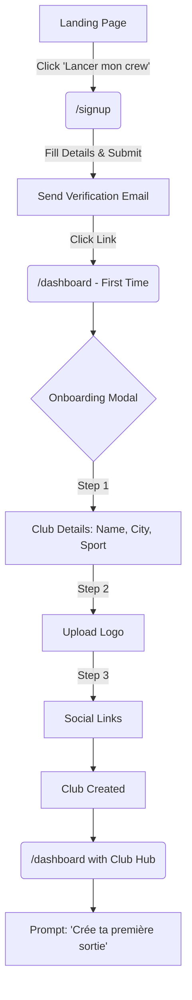

### 3. Edge Cases & Error Handling
- **Email already in use:** Show inline error: "Cet email est déjà utilisé. Connecte-toi."
- **Invalid password:** Enforce minimum requirements (e.g., 8 chars, 1 number). Show real-time validation.
- **Verification email lost:** Provide a "Renvoyer l'email" button on a holding screen.
- **User drops off during modal onboarding:** Next time they log in, force the modal to reappear until the club is created.

### 4. Screen-by-Screen Breakdown
- **Landing Page:** Hero section, CTA button with `Canvas` background and `Accent` text.
- **Signup Screen:** Centered card (`Beige cards`), input fields, Google Auth option.
- **Check Email Screen:** Illustration of an envelope, text instructing to check inbox.
- **Dashboard (Empty State):** Blurred background with the Onboarding Modal taking focus. Modal uses `Cards` styling (radius 24px).
- **Dashboard (Active):** Left sidebar navigation, top header, main content area showing the "First action prompt" in `Accent` color.

---

## Flow 2: Organizer Creates an Event

### 1. Step-by-Step UI Descriptions
1. From dashboard, clicks **"+ LANCER UN RUN"** button.
2. Redirected to `/dashboard/events/new`.
3. Fills event form:
   - **Title:** "Run & Chill #42 - République"
   - **Date & Time:** Thursday, 19:00
   - **Meeting point:** Search input with autocomplete (Google Places/Mapbox), drops pin on a mini-map.
   - **Max Participants:** 50
   - **Recurring:** Toggle set to No.
4. Clicks **"Publier"**.
5. Event is saved and user is redirected to the event detail page (`/dashboard/events/[id]`).
6. Share options modal/section appears:
   - Copy link button (`capten.app/event/[id]`)
   - QR code display to show physically
   - WhatsApp share button (pre-formatted message with link)
7. Organizer shares the link in their WhatsApp group.

### 2. Mermaid Flowchart
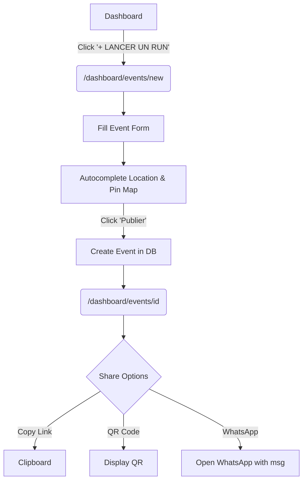

### 3. Edge Cases & Error Handling
- **Missing required fields:** Highlight missing fields in `Accent` color with error text.
- **Location API failure:** Allow manual text entry for the address if geolocation services fail.
- **Past date selected:** Block form submission; show error "La date doit être dans le futur."

### 4. Screen-by-Screen Breakdown
- **New Event Page:** Two-column layout. Left: Form inputs. Right: Live preview of the event card or the interactive map.
- **Event Detail Page:** Header with event stats (0 participants), Share Card prominently displayed, Tabs for Info / Check-ins.

---

## Flow 3: Member Joins a Club (First Time)

### 1. Step-by-Step UI Descriptions
1. Member clicks link in WhatsApp group: `capten.app/join/[club-slug]`.
2. Opens link on mobile browser.
3. Views Club Page: Logo, name, description, upcoming events list.
4. Clicks **"Rejoindre ce crew"**.
5. Phone number input screen appears.
6. Enters phone number → receives OTP via SMS.
7. Enters OTP → verified.
8. CAPTEN checks database for phone number. If NO (new member), proceed to step 9. (If YES, skip to step 12).
9. ICE (In Case of Emergency) Form appears:
   - Full name
   - Emergency contact name
   - Emergency contact phone
   - Relationship (Dropdown: Conjoint, Père, Mère, Ami, Autre)
   - Blood type (Optional dropdown)
   - Allergies (Optional text)
   - Medical conditions (Optional text)
10. Clicks **"Enregistrer"**.
11. Waiver/Décharge page appears:
    - Legal text in a scrollable box.
    - Checkbox: "J'atteste être apte à la pratique sportive"
    - Checkbox: "J'accepte les conditions de participation"
    - **"Signer la décharge"** button becomes active.
12. Confirmation Screen:
    - **"Bienvenue dans le crew ! 🏃"**
    - **"🥉 Badge débloqué : Premier Run"**
    - **"Ta micro-page CAPTEN"** (Link to `/p/[token]`)
    - List of upcoming events.
13. Member can now register for events.

### 2. Mermaid Flowchart
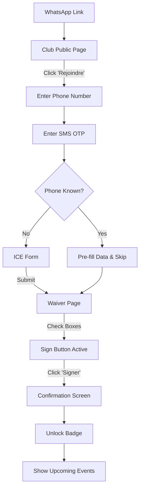

### 3. Edge Cases & Error Handling
- **Invalid phone number format:** Use a phone number formatter library. Display "Format invalide."
- **OTP not received:** 30-second countdown before "Renvoyer le code" appears.
- **Incomplete ICE form:** Highlight required fields. Ensure emergency phone format is valid.
- **Scroll requirement for waiver:** Optionally disable checkboxes until the user scrolls to the bottom of the legal text.

### 4. Screen-by-Screen Breakdown
- **Club Page:** Mobile-optimized, clean typography, hero image/logo.
- **Auth Flow:** Minimalist screens, large numeric keypad for OTP.
- **ICE Form:** Accessible form fields, standard HTML5 inputs for mobile keyboards.
- **Waiver Page:** Grey container for text (`Canvas`), highly visible checkboxes.
- **Success Screen:** Full-screen animation (Framer Motion), prominent badge display, CTA to view micro-page.

---

## Flow 4: Member Registers for an Event

### 1. Step-by-Step UI Descriptions
1. Member clicks event link from WhatsApp: `capten.app/event/[id]`.
2. Views event details: Title, date, time, location map, participants count (e.g., 12/50).
3. System checks auth state.
   - If not a member → redirected to join flow (Flow 3).
   - If already a member → sees **"S'inscrire"** button.
4. Clicks **"S'inscrire"**.
5. Confirmation overlay: **"Tu es inscrit ✅"** + event added to user's micro-page schedule.
6. System schedules a reminder (future scope: SMS/WhatsApp).

### 2. Mermaid Flowchart
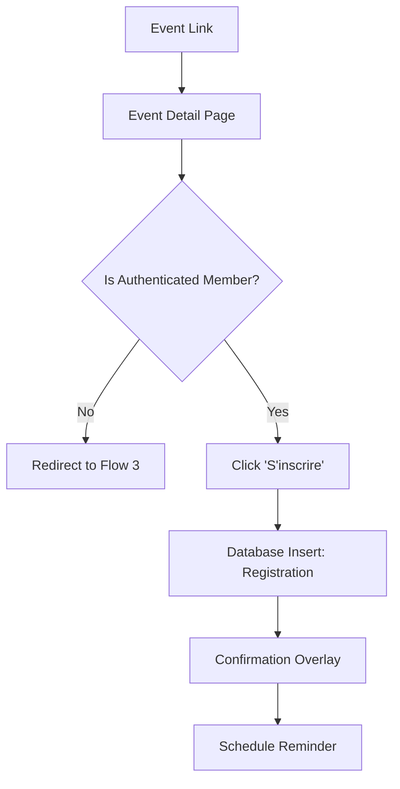

### 3. Edge Cases & Error Handling
- **Event is full:** Button state changes to "Complet", disable click. Optional: "Rejoindre la liste d'attente".
- **Already registered:** Button reads "Inscrit", allows user to click to "Se désinscrire".
- **Event in the past:** Hide registration button.

### 4. Screen-by-Screen Breakdown
- **Event Detail Page:** Sticky bottom bar on mobile with the "S'inscrire" CTA. Large map header.
- **Confirmation:** Bottom sheet or toast notification with success icon.

---

## Flow 5: Member Check-in at Event (GPS)

### 1. Step-by-Step UI Descriptions
1. Member arrives at the meeting point.
2. Opens check-in link (from reminder or event page): `capten.app/checkin/[id]`.
3. Browser prompts for GPS permission → Member allows.
4. UI shows loading state: **"Localisation en cours..."**
5. GPS position acquired and sent to backend.
6. System calculates distance (haversine formula) from meeting point coordinates.
7. Decision logic:
   - **Distance ≤ 200m:**
     - Show ✅ **"Check-in validé !"**
     - Confetti animation (Framer Motion / Canvas).
     - If milestone reached: **"🔥 Badge débloqué : Régulier !"**
     - Check-in timestamp recorded in DB.
   - **Distance > 200m:**
     - Show ❌ **"Tu es trop loin du point de rendez-vous"**
     - Display distance: "Tu es à 1.2 km du lieu de départ."
     - Show minimap with user position vs. meeting point.
     - Provide **"Réessayer"** button.
8. Live update pushed to Organizer Dashboard.

### 2. Mermaid Flowchart
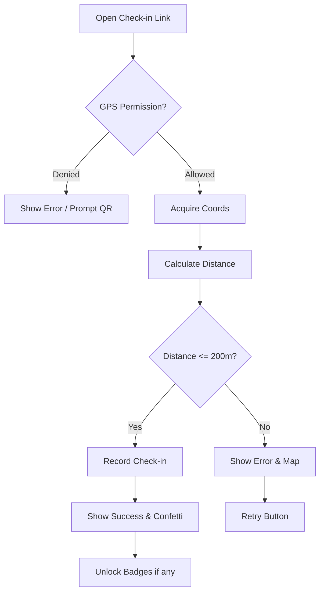

### 3. Edge Cases & Error Handling
- **GPS denied:** Fallback UI explaining how to enable it, or instruct them to ask the organizer for the QR code (Flow 6).
- **Poor GPS signal:** Show a timeout error after 15 seconds, prompt to retry or use QR.
- **Network drop:** Cache the check-in locally and sync once connection is restored, but show a "pending" UI.

### 4. Screen-by-Screen Breakdown
- **Loading Screen:** Radar/pulsing animation.
- **Success Screen:** Green accent colors, large checkmark, dynamic badge reveals.
- **Failure Screen:** Orange/Red accent, clear map visualization of the distance gap.

---

## Flow 6: Member Check-in at Event (QR Code)

### 1. Step-by-Step UI Descriptions
1. Member arrives at the meeting point.
2. Organizer opens the event on their phone and displays the event QR code.
3. Member opens their native phone camera and scans the QR code.
4. Opens URL: `capten.app/checkin/[event_id]?source=qr`.
5. System identifies the authenticated user and validates check-in (since scanning the organizer's QR proves physical proximity).
6. Success screen identical to GPS flow appears.

### 2. Mermaid Flowchart
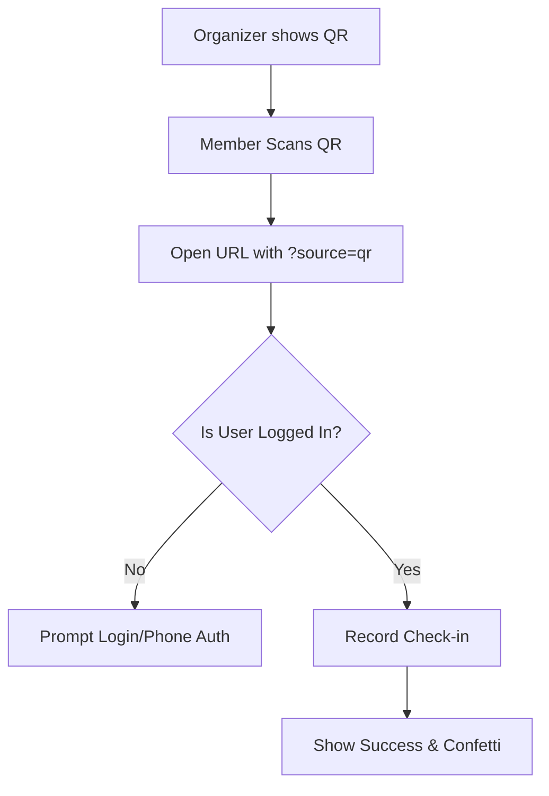

### 3. Edge Cases & Error Handling
- **User not logged in:** Redirect to OTP login screen, then automatically process the check-in post-login.
- **QR Code expires (optional security):** If QR is dynamic and rotated, show "Code QR expiré, demande à l'organisateur de rafraîchir."

### 4. Screen-by-Screen Breakdown
- **Camera to Browser transition:** Seamless redirect.
- **Success Screen:** Same as Flow 5.

---

## Flow 7: Organizer Views Live Check-ins

### 1. Step-by-Step UI Descriptions
1. Organizer opens `/dashboard/events/[id]`.
2. Clicks the **"Check-ins"** tab.
3. Sees a real-time counter: e.g., **"0/48 check-ins"**.
4. As members check in (via GPS or QR), Supabase Realtime pushes updates:
   - Counter increments: "1/48", "2/48".
   - New row added to the list: Avatar, Name, Time, Method (Icon: GPS or QR), Distance.
   - Map component plots new dots for GPS check-ins.
5. Post-event: Organizer can view the finalized attendance registry.
6. Clicks **"Exporter"** to download as PDF or CSV.

### 2. Mermaid Flowchart
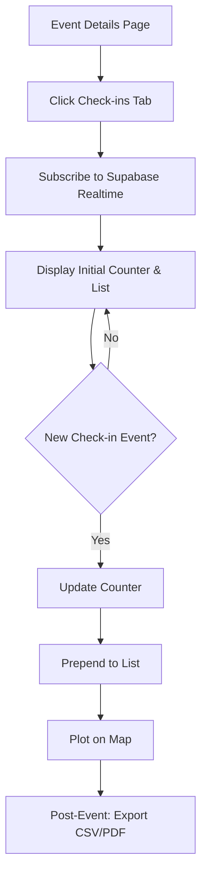

### 3. Edge Cases & Error Handling
- **Realtime connection lost:** Show a small warning icon "Déconnecté du direct", attempt silent reconnects. Provide manual refresh button.
- **High volume check-ins:** Virtualize the list rendering if participants > 100 to maintain UI performance.

### 4. Screen-by-Screen Breakdown
- **Check-ins Tab:** Split view or card stack. Top metric cards (Total, Check-ins, Pending). List view uses `Cards` styling.
- **Map View:** Clustered markers for dense check-ins.

---

## Flow 8: Emergency Situation (ICE Access)

### 1. Step-by-Step UI Descriptions
1. During an event, a member is injured.
2. Organizer opens CAPTEN on their mobile device.
3. Navigates to `/dashboard/events/[current_event_id]`.
4. Uses the search bar or scrolls the check-in list to find the member.
5. Clicks on the member's name.
6. A modal/bottom sheet opens displaying the ICE Card immediately:
   - Emergency Contact Name & Relationship (e.g., Marie Diallo - Mère)
   - Phone Number (Masked partially until tapped or full)
   - Blood Type
   - Allergies
   - Medical Conditions
7. Organizer taps the phone number (uses `tel:` protocol) to call the emergency contact directly.
8. Optional: Taps "Partager avec les secours" to generate a quick text summary for SAMU (15).

### 2. Mermaid Flowchart
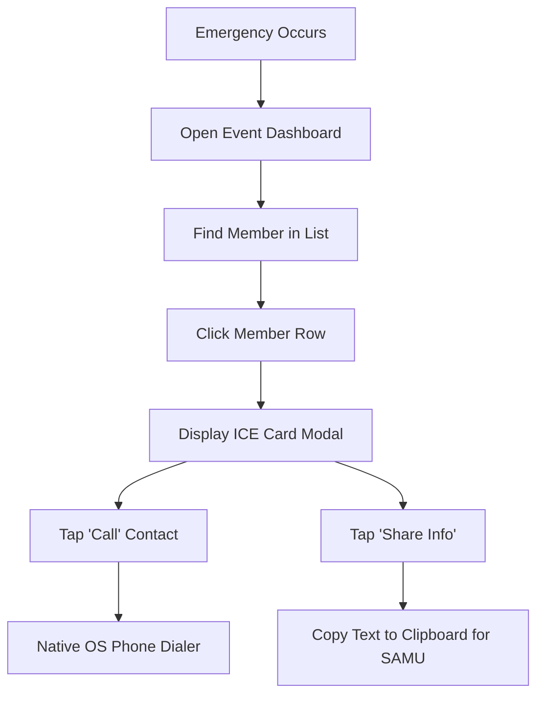

### 3. Edge Cases & Error Handling
- **No network in remote area:** PWA must cache check-in list and ICE data locally upon event start (Service Worker caching).
- **Missing ICE info:** Display clear warning if member somehow bypassed it (legacy accounts).

### 4. Screen-by-Screen Breakdown
- **List View:** Search bar prominent at the top.
- **ICE Card:** Use `Warning` or `Accent` colors for the header to indicate critical information. Large, highly legible typography (Plus Jakarta Sans, bold).

---

## Flow 9: CAPTEN Spots Transaction

### 1. Step-by-Step UI Descriptions
1. Post-run, the group visits a partner café (CAPTEN Spot).
2. Organizer or member scans the CAPTEN Spot QR code placed on the counter.
3. Redirected to `capten.app/spots/[spot_id]/transaction`.
4. App identifies user as Organizer of "Paris Run Club".
5. Organizer enters the total consumption amount: e.g., **"180 €"**.
6. System calculates the kickback based on partner terms (e.g., 10% = 18 €).
7. Submits the form.
8. Confirmation screen: **"18 € ajoutés à la cagnotte du Paris Run Club !"**
9. Transaction is recorded as pending/verified.
10. Dashboard cagnotte (wallet) balance updates.

### 2. Mermaid Flowchart
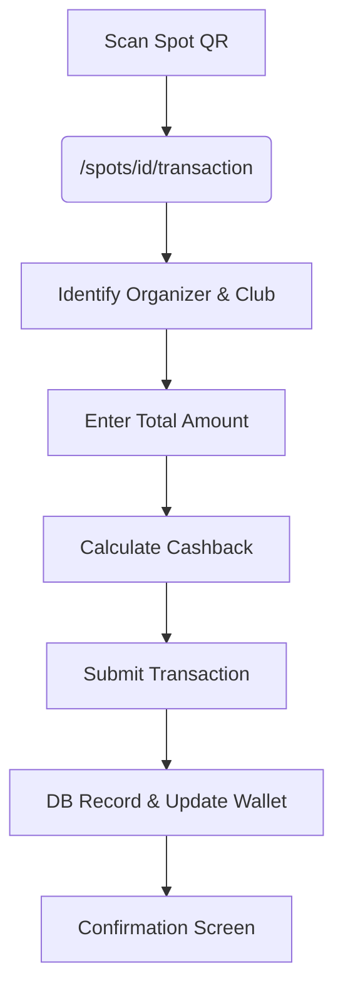

### 3. Edge Cases & Error Handling
- **Unauthorized user scans QR:** Show "Seuls les organisateurs peuvent valider une transaction."
- **Invalid amount:** Prevent negative or zero amounts.
- **Spot not active:** Show "Ce partenaire n'accepte plus les transactions CAPTEN actuellement."

### 4. Screen-by-Screen Breakdown
- **Transaction Entry:** Simple keypad or numeric input, large font. Show calculation dynamically: "180€ -> 18€ cagnotte".
- **Success Screen:** Coin animation, updated wallet balance prominently displayed.

---

## Flow 10: Member Returns to Different Club (Passeport CAPTEN)

### 1. Step-by-Step UI Descriptions
1. Existing member (Paris Run Club) clicks join link for a new club: `capten.app/join/lyon-social-run`.
2. Enters their existing phone number.
3. OTP verification via SMS.
4. CAPTEN recognizes the phone number.
5. System bypasses the onboarding form and pre-fills all data (Name, ICE, Medical) in the background.
6. User is immediately shown the Waiver/Décharge page for the specific new club.
7. User signs the new waiver.
8. Member is now linked to both clubs.
9. Redirected to their micro-page, which now aggregates events from both clubs.
10. Badges accumulate globally across the Passeport CAPTEN.

### 2. Mermaid Flowchart
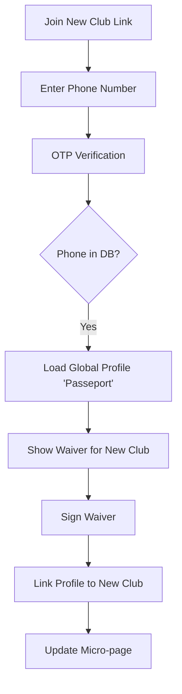

### 3. Edge Cases & Error Handling
- **User wants to update ICE data during join:** Provide an "Éditer mes informations" button on the waiver page or immediately after.
- **Account locked/banned:** Prevent joining new clubs if global account flag is negative.

### 4. Screen-by-Screen Breakdown
- **Waiver Page:** Contains a banner: "Heureux de te revoir, [Name] ! Il ne reste plus qu'à signer la décharge du [New Club]."
- **Micro-page:** Tabbed or sectioned view distinguishing events by club.

---

## Flow 11: Member Views Micro-Page

### 1. Step-by-Step UI Descriptions
1. Member opens their personal link (persisted or from SMS/Email): `capten.app/p/[token]`.
2. Top section: Digital Member Card
   - Name, Avatar
   - "Membre depuis [Year]"
   - Total participations count
   - Current Level/Status (e.g., "Runner Régulier")
3. Middle section: Upcoming Events (horizontal scroll or list). Allows quick unregistration or view details.
4. Bottom section: Badges Grid.
   - Earned badges in full color.
   - Locked badges in greyscale with a lock icon.
5. Settings/Menu access: Allows user to click "Gérer mes infos d'urgence" to edit ICE data.
6. Ability to view PDF versions of signed waivers.

### 2. Mermaid Flowchart
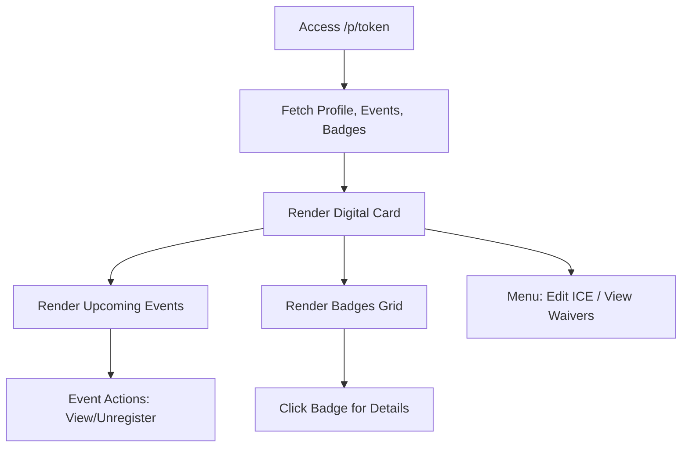

### 3. Edge Cases & Error Handling
- **Invalid/Revoked Token:** Redirect to phone login to issue a new session/token.
- **No upcoming events:** Display empty state: "Pas de sortie prévue pour le moment."
- **Data sync issues:** Skeleton loaders during fetch to maintain layout stability.

### 4. Screen-by-Screen Breakdown
- **Micro-page layout:** Mobile-first vertical scroll.
- **Member Card:** Styled like a physical credit card with glassmorphism effects, `Canvas` base with `Accent` glows.
- **Badges:** Grid system. Tapping a badge opens a toast/tooltip explaining how it was earned or how to unlock it.
- **Settings Modal:** Clean forms matching the initial onboarding experience.

---
*End of Document*
